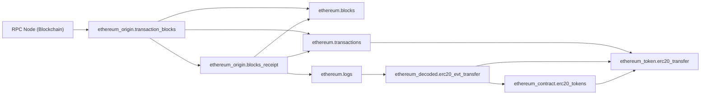

# Data Warehouse Lineage

Biểu đồ thể hiện sự phụ thuộc (lineage) giữa các bảng trong warehouse.
Mũi tên `-->` nghĩa là "được sử dụng để tạo ra".

## Mermaid Graph

## Bảng chi tiết

| Bảng | Upstream | Downstream |
|---|---|---|
| `ethereum.blocks` | ethereum_origin.transaction_blocks, ethereum_origin.blocks_receipt | _none_ |
| `ethereum.logs` | ethereum_origin.blocks_receipt | ethereum_decoded.erc20_evt_transfer |
| `ethereum.transactions` | ethereum_origin.transaction_blocks, ethereum_origin.blocks_receipt | ethereum_token.erc20_transfer |
| `ethereum_contract.erc20_tokens` | ethereum_decoded.erc20_evt_transfer | ethereum_token.erc20_transfer |
| `ethereum_decoded.erc20_evt_transfer` | ethereum.logs | ethereum_contract.erc20_tokens, ethereum_token.erc20_transfer |
| `ethereum_origin.blocks_receipt` | ethereum_origin.transaction_blocks | ethereum.blocks, ethereum.logs, ethereum.transactions |
| `ethereum_origin.transaction_blocks` | _none_ (RPC Node)_ | ethereum.blocks, ethereum.transactions, ethereum_origin.blocks_receipt |
| `ethereum_token.erc20_transfer` | ethereum.transactions, ethereum_decoded.erc20_evt_transfer, ethereum_contract.erc20_tokens | _none_ |

## Root tables (không có upstream)

- `ethereum_origin.transaction_blocks`

## Leaf tables (không có downstream)

- `ethereum.blocks`
- `ethereum_token.erc20_transfer`
